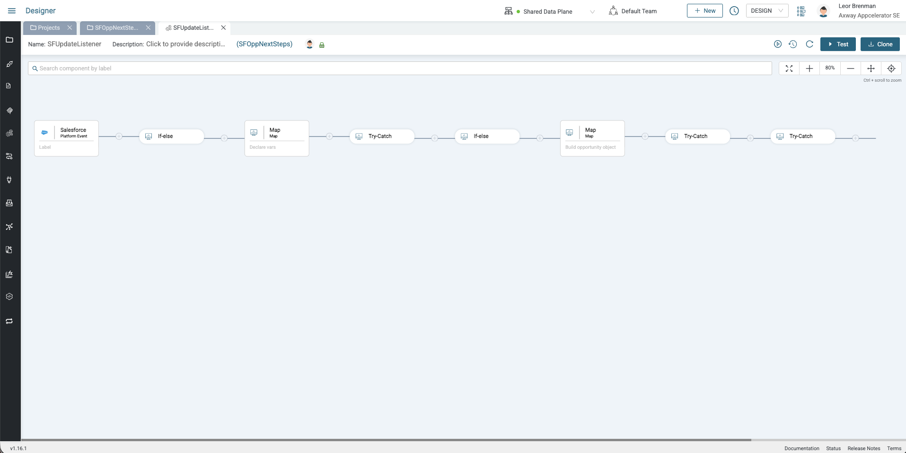
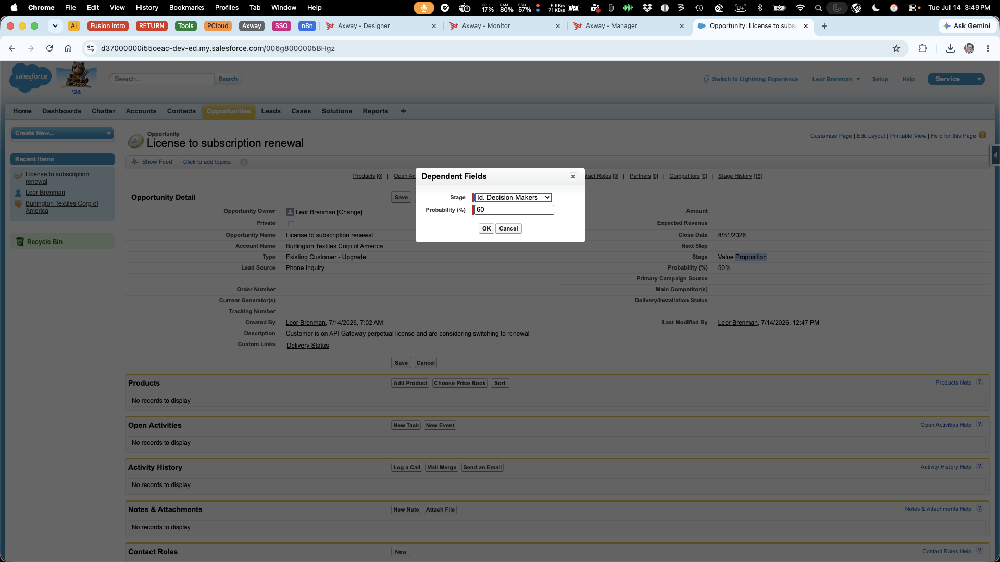
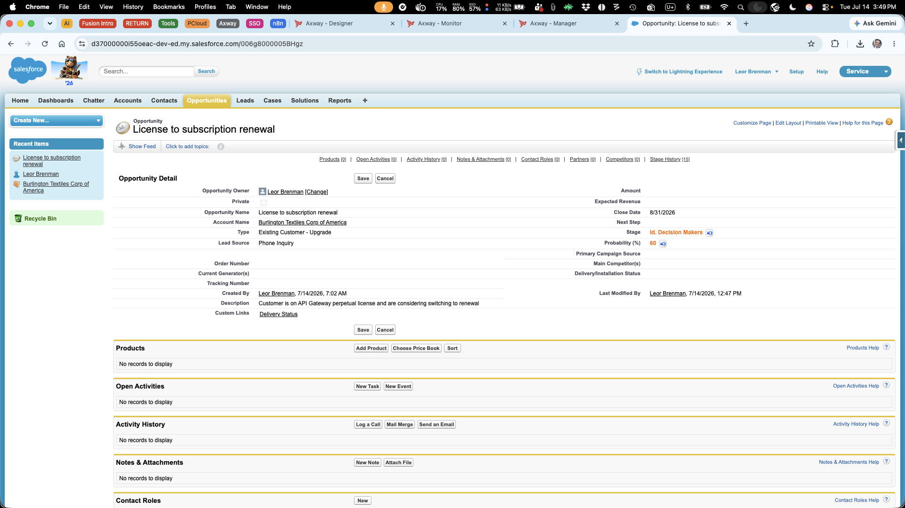
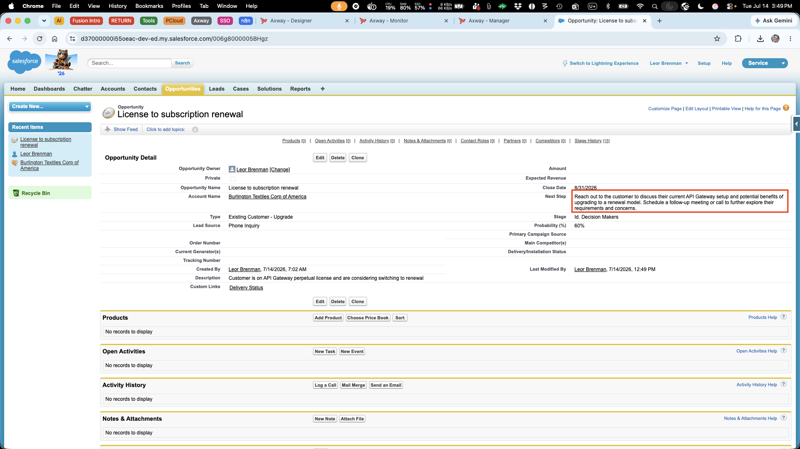
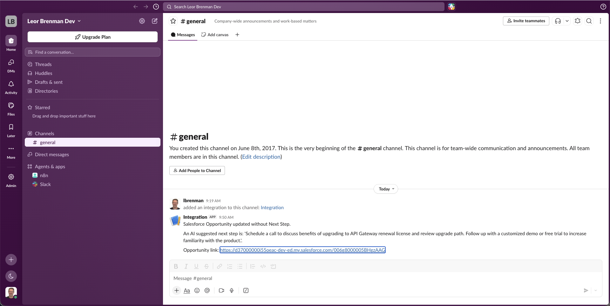

# Amplify Fusion - AI-Powered Salesforce Opportunity Next-Step Generator

This workflow automatically analyzes new and updated Salesforce Opportunities and generates AI-driven next-step recommendations, then updates Salesforce and notifies the sales team via Slack.

## How it works

The main integration listens for new and updated Salesforce opportunities via a Salesforce Platform event and checks to see if the opportunity is still open and missing a next step. It then uses AI to determine a concise next step and updates the opportunity.

## Setup steps

1. In Salesforce, configure a platform event for new and updated opportunities (see Apex code below)
2. In Fusion, import the Fusion project
3. Configure the LLM and Salesforce Connectors
4. Activate the integration and create an opportunity without a NextStep
5. Refresh the screen to see that the update is created

Once enabled, this automation continuously improves pipeline visibility, ensures timely follow-ups, and reduces missed sales actions.

## Salesforce Apex

```java
public class RecordUpsertPublisher {
    public static void publish(List<SObject> records, String objectName) {
        List<Record_Upsert__e> events = new List<Record_Upsert__e>();

        for (SObject record : records) {
            Record_Upsert__e event = new Record_Upsert__e();
            event.RecordId__c = (String)record.get('Id');
            event.ObjectName__c = objectName;
            event.ChangeType__c = Trigger.isInsert ? 'Created' : 'Updated';
            events.add(event);
        }

        if (!events.isEmpty()) {
            EventBus.publish(events);
        }
    }
}

trigger OpportunityTrigger on Opportunity (after insert, after update) {
    RecordUpsertPublisher.publish(Trigger.new, 'Opportunity');
}
```

## Screenshots

Fusion Integration
  

Edit Opportunity
  
  
  

Next Step automatically added (optionally)
  

Slack Notification
  